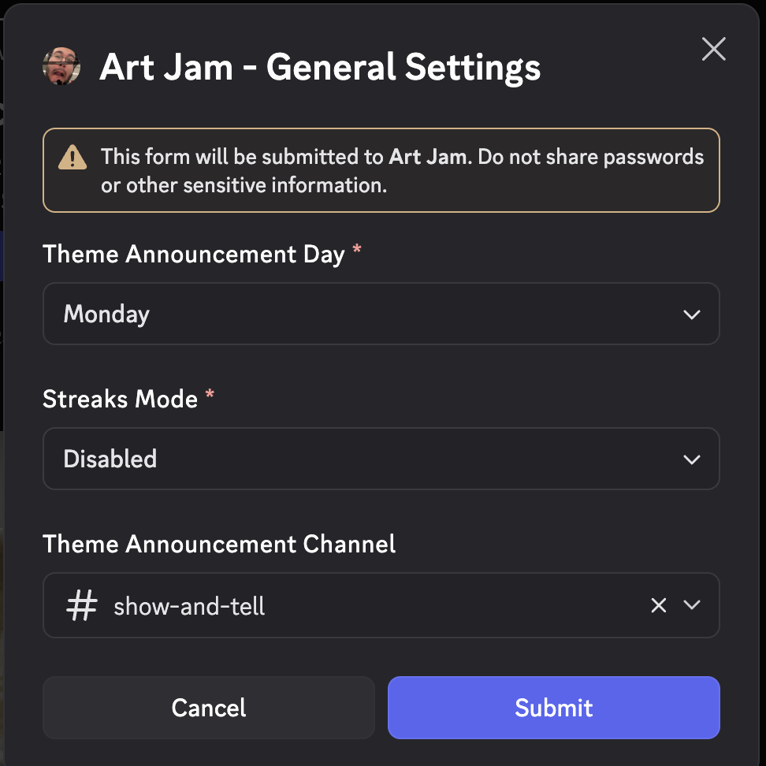
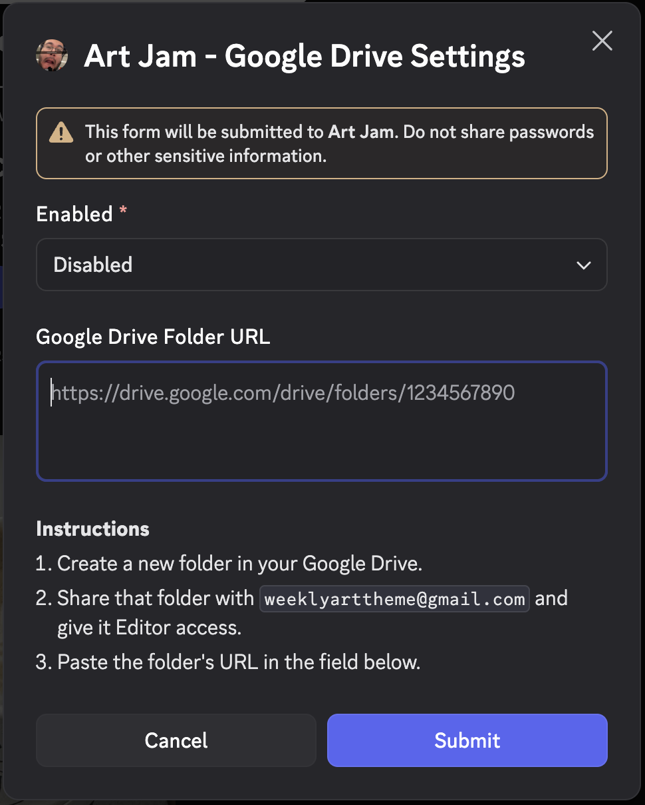

# Art Jam Bot

## Description
Each week, we will generate a theme for art creation. Participants will create and submit their artwork based on the weekly theme. This discord bot will announce the theme, create a google drive folder for theme submissions, and upload submission (discord attachments in reply messages) to the folder (for archival purposes).

## Features
- Weekly Generated Themes
- User Submissions
- Cross-Guild submissions means that you can submit your art work once and share with all the guilds you are apart of (that also have this bot)
- Google Drive Integration (allow your guild to setup a google drive folder to archive all submissions)

## Planned Features
- Streaks: If this feature is enabled users will be able to see the current streak on each submission or by running a command. The two modes will be continuous streak or accumulative (each submissions gives a set amount of points that just get added to the users total).
- Global Submissions: Users will be able to opt in to sharing there submissions globally. This will share their submissions almost like a socially media posts. Any users of the bot will be able to browser all the global submissions for any particular week.

## Setup
### 1. [Invite the bot](https://discord.com/oauth2/authorize?client_id=1436075080835792998&permissions=2251799813720064&integration_type=0&scope=bot) to your server
### 2. Run `/settings general` to configure the theme announcement channel
### 3. If you want to display the current theme in the middle of the week, run `/theme` command in the theme announcement channel to create a new announcement message.

## Google Drive Setup (optional)

### 1. Run `/settings google-drive` and follow the modal instructions to share your Google Drive folder with the bot.
### 2. Paste the share link into the text input 

*All future theme announcements will automatically create a submission folder in your Google Drive and save each submission to the folder for archival purposes.*

## Development
### Vocab
- Theme: Simple text description. Usually one or two words, like "Gravity" or "Metal"
- Jam: In the context of this bot, is an event or period that starts with generation of a theme, can be submitted to by users, and ends at the deadline
- Submission: A submission is a user entry to a jam. It consist of an optional description and 1 to many attachments of the created art

### Potential Future Improvements
- Multi submission strategy
  - Allow Multi Submission? Maybe do something to separate them in google drive?
  - Maybe have a setting to control if its allow and different strategies for handling it? Replace, Keep Both, etc
- Setting for Storage Format
  - flat (so its easier to look through the pictures)
  - folder per submission (so its more organized)
- More Storage Integrations
  - S3 Compatible Bucket
  - SFTP
- Suggest themes commands
- Global Submission Web App
  - See all submissions by theme
  - See all submissions by a specific user
  - Allow users to show their discord username with submissions
    - Allow users to hide real username, but set a nickname
- Edit Existing Submission
- Report Submissions